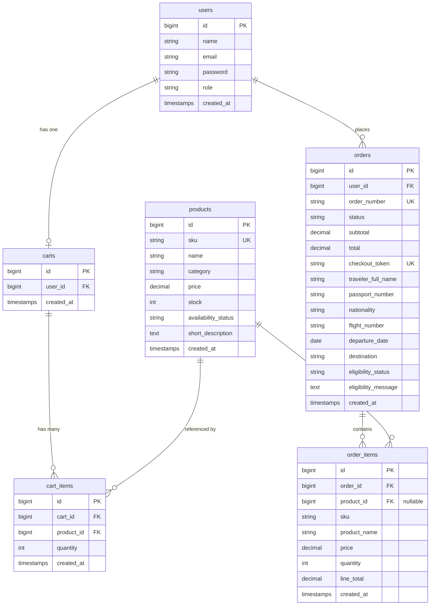

# DutyFree Shop

A duty-free ordering system built with Laravel 12. Customers browse products, go through a traveler verification step, and place orders. Admins manage the catalog and track order statuses. It's a full end-to-end flow — authentication, cart, checkout, orders, and email notifications — kept intentionally clean so every part is easy to follow.

---

## Table of Contents

- [System Architecture](#system-architecture)
- [Technical Decisions](#technical-decisions)
- [Database Design](#database-design)
- [Features](#features)
- [How to Run Locally](#how-to-run-locally)
- [Demo Accounts](#demo-accounts)
- [Tech Stack](#tech-stack)

---

## System Architecture

The app is structured around Laravel's MVC pattern with a small service layer sitting between the controllers and the models. The idea is simple: controllers handle HTTP, services handle business logic, models handle data.

```
Browser → web.php (routes) → Middleware → Controller
                                              ├── FormRequest  (validates input)
                                              ├── Service      (business logic)
                                              └── Eloquent     (talks to MySQL)
                                                      │
                                                 Blade View
```

### How the pieces fit together

**Routes (`web.php`)** are grouped into four clear sections:

```
Public   →  Anyone can browse products (no login required)
Guest    →  Login and register pages (redirects away if already logged in)
Customer →  Cart, checkout, and order history (must be logged in)
Admin    →  Product CRUD and order management (must be logged in as admin)
```

**Middleware** does the simple work — `auth` keeps unauthenticated users out of cart and checkout, `guest` stops logged-in users from hitting the login page again. Role enforcement (admin vs customer) lives inside the controllers themselves rather than in a separate middleware layer.

**Form Requests** keep validation out of controllers. `StoreTravelerRequest` validates the traveler info at checkout, `StoreProductRequest` handles product creation/editing.

**`TravelerVerificationService`** is the one service class in the project. It simulates what would normally be an external API call — checking that the flight number is valid, the departure date is in the future, and the traveler is eligible. Keeping it in its own class means the controller stays thin and the logic is easy to test or swap out later.

**Mailables** (`OrderPlaced`, `OrderStatusUpdated`, `OrderCancelled`) handle email notifications. They write to the log file instead of sending real emails, so there's nothing to configure.

---

## Technical Decisions

These are the choices that might not be immediately obvious, and the reasoning behind them.

**Manual auth instead of Laravel Breeze**
Breeze generates a lot of scaffolding that makes it harder to see what's actually happening. The three auth controllers (`LoginController`, `RegisterController`, `LogoutController`) do exactly what they say — nothing hidden.

**Database-backed cart instead of session cart**
Storing the cart in `carts` / `cart_items` tables means it persists across sessions, survives browser restarts, and works cleanly with stock validation. It also means the cart is a proper Eloquent relationship rather than a blob in the session.

**`DB::transaction` + `lockForUpdate` when placing an order**
When two customers try to buy the last item at the same time, a standard read-then-write would let both through. Wrapping the stock deduction in a transaction with a pessimistic lock means only one request wins — the other gets an out-of-stock error.

**`checkout_token` to prevent duplicate orders**
A UUID is generated for each checkout attempt and stored as a unique column on the order. If the same form gets submitted twice (double-click, back-and-resubmit), the second insert fails the unique constraint. Simple and effective.

**Role column instead of a full permission package**
Admin vs customer is stored as a string in `users.role`. Each admin controller checks `abort_unless(auth()->user()->isAdmin(), 403)` at the top. It's explicit and readable. Spatie Permission is a straightforward upgrade when the project grows.

**Client-side search and category filter**
With a small product catalog, there's no reason to hit the server every time someone types or clicks a category. All products are loaded once, and jQuery handles the filtering in the browser — instant feedback, no page reloads.

**Emails log to file instead of sending**
Setting `MAIL_MAILER=log` means every "sent" email shows up in `storage/logs/laravel.log`. The full email notification flow (order placed, status updated, cancelled) is demonstrated without needing an SMTP server or a Mailtrap account.

---

## Database Design

Six tables. The schema is intentionally straightforward — each table has one clear purpose and the foreign keys make the relationships obvious.



A few things worth noting:

- `order_items.product_id` is **nullable**. When a product gets deleted, the order item stays intact. The `sku` and `product_name` are snapshotted at the time of checkout specifically so the order history always shows what was actually purchased.
- `orders.checkout_token` is a unique UUID per checkout — the duplicate-order guard mentioned above.
- `orders.eligibility_status` and `eligibility_message` record the result of the traveler check so it's auditable after the fact.
- Order status flows: `pending → verified → paid → ready_for_pickup`, or `cancelled` if the customer cancels before it's processed.

### Migration files

| Migration | Creates |
|---|---|
| `0001_01_01_000000_create_users_table.php` | `users`, `password_reset_tokens`, `sessions` |
| `2026_01_01_000010_create_products_table.php` | `products` |
| `2026_01_01_000020_create_carts_table.php` | `carts` |
| `2026_01_01_000030_create_cart_items_table.php` | `cart_items` |
| `2026_01_01_000040_create_orders_table.php` | `orders` |
| `2026_01_01_000050_create_order_items_table.php` | `order_items` |

---

## Features

**For customers:**
- Register, log in, log out
- Browse all duty-free products — filter by category or search by name, no page reload
- View individual product details
- Add items to cart via AJAX (cart badge updates instantly, Bootstrap toast confirms the action)
- Manage cart — update quantities, remove items, see running total
- Fill in traveler details before checkout (passport, flight number, departure date, etc.)
- System verifies eligibility before allowing the order through
- Review the order on a confirmation page before committing
- View full order history and individual order details
- Cancel a pending order — stock is automatically restored

**For admins:**
- Create, edit, and manage all products
- View all orders with full traveler and eligibility details
- Update order status: verified → paid → ready for pickup
- Status changes trigger an email notification to the customer (logged)

---

## How to Run Locally

### What you need

- [XAMPP](https://www.apachefriends.org/) — provides PHP 8.2+ and MySQL/MariaDB out of the box
- [Composer](https://getcomposer.org/)
- Node.js 18+ and npm

### Setup

**1. Start XAMPP**

Open the XAMPP Control Panel and start both **Apache** and **MySQL**.

**2. Create the database**

Open [phpMyAdmin](http://localhost/phpmyadmin), click **New**, and create a database named `ecomm` with collation `utf8mb4_unicode_ci`.

Or paste this into the phpMyAdmin SQL tab:

```sql
CREATE DATABASE ecomm CHARACTER SET utf8mb4 COLLATE utf8mb4_unicode_ci;
```

**3. Clone the repository**

```bash
git clone https://github.com/ricojohn/ecomm.git
cd ecomm
```

**4. Install dependencies**

```bash
composer install
npm install
npm run build
```

**5. Set up your environment file**

```bash
cp .env.example .env
php artisan key:generate
```

**6. Point it at your XAMPP database**

Open `.env` and confirm these values (XAMPP's default MySQL has no password):

```env
DB_CONNECTION=mysql
DB_HOST=127.0.0.1
DB_PORT=3306
DB_DATABASE=ecomm
DB_USERNAME=root
DB_PASSWORD=
```

**7. Confirm email logging is on**

Check that `.env` has this (it should be the default):

```env
MAIL_MAILER=log
```

**8. Run migrations and seed demo data**

```bash
php artisan migrate:fresh --seed
```

This creates all the tables and loads two demo accounts plus 10 sample products.

**9. Start the development server**

```bash
php artisan serve
```

Open [http://localhost:8000](http://localhost:8000) in your browser.

> **PowerShell tip:** Use `;` instead of `&&` to chain commands, e.g. `php artisan migrate:fresh --seed; php artisan serve`

### Viewing simulated emails

Emails are logged to a file instead of actually sent. You can find them here:

```
storage/logs/laravel.log
```

Search for `Subject:` in the file to jump to any email entry.

---

## Demo Accounts

| Role     | Email              | Password |
|----------|--------------------|----------|
| Admin    | admin@ecomm.com    | password |
| Customer | customer@ecomm.com | password |

---

## Tech Stack

| | |
|---|---|
| Framework | Laravel 12 |
| Language | PHP 8.2+ |
| Database | MySQL/MariaDB via XAMPP |
| ORM | Eloquent |
| Frontend | Blade + Bootstrap 5 + Bootstrap Icons |
| JavaScript | jQuery 3.7 (AJAX cart, client-side filtering) |
| Email | Laravel Mailables via log driver |
| Build tool | Vite |
| Timezone | Asia/Manila |
| Currency | Philippine Peso (₱) |
