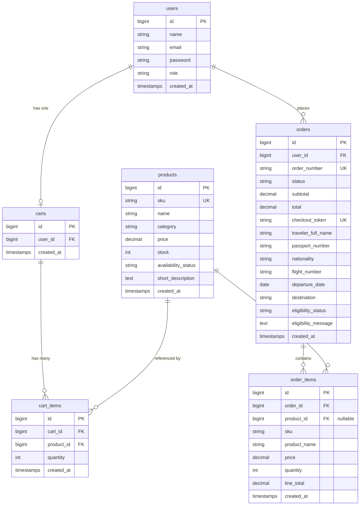

# DutyFree — Laravel Duty-Free Ordering System

A duty-free ordering system built as a Laravel 12 assessment project. Customers can browse products, verify their traveler eligibility, and place orders. Admins manage the product catalog and update order statuses.

---

## Table of Contents

1. [System Architecture](#system-architecture)
2. [Technical Decisions](#technical-decisions)
3. [Database Design](#database-design)
4. [Features](#features)
5. [How to Run the Application Locally](#how-to-run-the-application-locally)
6. [Demo Accounts](#demo-accounts)
7. [Tech Stack](#tech-stack)

---

## System Architecture

The application follows Laravel's standard MVC pattern with an additional Service layer for business logic that should not live in controllers.

```
┌─────────┐     ┌──────────┐     ┌────────────┐     ┌─────────────────────┐
│ Browser │────▶│ Routes   │────▶│ Middleware │────▶│    Controller       │
└─────────┘     │ web.php  │     │ auth/guest │     │                     │
                └──────────┘     └────────────┘     │  ┌───────────────┐  │
                                                     │  │ FormRequest   │  │
                                                     │  │ (Validation)  │  │
                                                     │  └───────────────┘  │
                                                     │  ┌───────────────┐  │
                                                     │  │ Service Class │  │
                                                     │  │ (Business     │  │
                                                     │  │  Logic)       │  │
                                                     │  └───────────────┘  │
                                                     │  ┌───────────────┐  │
                                                     │  │ Eloquent ORM  │  │
                                                     │  └──────┬────────┘  │
                                                     └─────────┼───────────┘
                                                               │
                                                    ┌──────────▼──────────┐
                                                    │       MySQL         │
                                                    └──────────┬──────────┘
                                                               │
                                                    ┌──────────▼──────────┐
                                                    │    Blade Views      │
                                                    │  (Bootstrap 5 UI)   │
                                                    └─────────────────────┘
```

### Layers

| Layer | Responsibility |
|---|---|
| **Routes** (`routes/web.php`) | Maps HTTP verbs + URIs to controllers; grouped by public / guest / customer / admin |
| **Middleware** | `auth` guards customer and admin routes; `guest` prevents logged-in users from seeing login/register |
| **Controllers** | Thin — receive input, delegate to services/models, return responses |
| **Form Requests** | Encapsulate validation rules (`StoreTravelerRequest`, `StoreProductRequest`) |
| **Service** | `TravelerVerificationService` — simulates an external eligibility check, decoupled from the HTTP layer |
| **Models** | Eloquent models with relationships, accessors, and casts |
| **Mail** | `OrderPlaced`, `OrderStatusUpdated`, `OrderCancelled` Mailable classes; logged via `MAIL_MAILER=log` |

### Route Groups

```
Public      GET /                   Product listing (browse, no auth)
            GET /products/{id}      Product detail

Guest       GET|POST /login
            GET|POST /register

Auth        GET|POST /cart/*        Cart management
            GET|POST /checkout/*    Traveler form → confirm → place order
            GET|PATCH /orders/*     Order history and cancellation

Admin       /admin/products/*       Product CRUD
            /admin/orders/*         Order list, detail, status update
```

### Role System

Two roles are stored in the `users.role` column (`admin` / `customer`). Role enforcement is handled directly inside each admin controller with `abort_unless(auth()->user()->isAdmin(), 403)`. No middleware is used for role checks; Spatie Permission can be integrated later.

---

## Technical Decisions

### Manual Authentication (not Laravel Breeze)
Breeze scaffolds extra files that obscure how authentication works. Manual `LoginController`, `RegisterController`, and `LogoutController` keep the auth flow explicit and easy to review.

### Database-Backed Cart
The cart is persisted in the `carts` / `cart_items` tables rather than in the session. This means the cart survives browser restarts, supports proper stock queries, and can be inspected or managed from the admin side if needed.

### `DB::transaction` + `lockForUpdate` on Order Placement
When an order is placed, stock is decremented inside a transaction with a pessimistic lock (`lockForUpdate`) on the product rows. This prevents two concurrent checkouts from both "seeing" the same available stock and overselling.

### Unique `checkout_token`
A `Str::uuid()` token is generated and stored with each order. A second submission of the same cart (e.g. double-click, browser back + resubmit) will fail the unique constraint, preventing duplicate orders.

### Traveler Verification as a Service Class
`App\Services\TravelerVerificationService` simulates calling an external eligibility API. It validates the flight number format (`[A-Z]{2}\d{3,4}`), confirms the departure date is in the future, and returns an eligibility result. Extracting this into a service keeps the controller thin and makes it easy to swap in a real API call later.

### Email Simulation via Log Driver
Three Mailable classes (`OrderPlaced`, `OrderStatusUpdated`, `OrderCancelled`) demonstrate the full notification pattern. With `MAIL_MAILER=log` in `.env`, emails are written to `storage/logs/laravel.log` instead of being sent — no SMTP setup needed to demo or test the feature.

### Client-Side Search and Category Filter
Product search (by name) and category filtering run entirely in the browser using jQuery. All products are loaded at once via `Product::get()`. This avoids server round-trips and page reloads, giving instant feedback on the product listing page.

### Role Check Inside Controllers
`abort_unless(auth()->user()->isAdmin(), 403)` is called at the top of each admin controller method. This is deliberate — it keeps the authorization logic visible and co-located with the action it protects, which is appropriate for an assessment project. Middleware-based or Spatie-based role checks are a straightforward drop-in upgrade.

---

## Database Design

Six tables form the core schema. Relationships are enforced at the database level with foreign key constraints.



### Key Design Notes

- **`order_items.product_id` is nullable** — if a product is deleted after an order is placed, the order item record is preserved (with `sku` and `product_name` snapshotted at checkout time) rather than cascade-deleted.
- **`orders.checkout_token`** — unique UUID generated per checkout attempt to prevent duplicate order placement.
- **`orders.eligibility_status / eligibility_message`** — stores the result of the `TravelerVerificationService` check alongside the order for auditability.
- **Order statuses**: `pending` → `verified` → `paid` → `ready_for_pickup` (or `cancelled`).

### Migration Files

All migrations are in `database/migrations/`:

| File | Table |
|---|---|
| `0001_01_01_000000_create_users_table.php` | `users`, `password_reset_tokens`, `sessions` |
| `2026_01_01_000010_create_products_table.php` | `products` |
| `2026_01_01_000020_create_carts_table.php` | `carts` |
| `2026_01_01_000030_create_cart_items_table.php` | `cart_items` |
| `2026_01_01_000040_create_orders_table.php` | `orders` |
| `2026_01_01_000050_create_order_items_table.php` | `order_items` |

---

## Features

| Area | Feature |
|---|---|
| Auth | Customer registration, login, logout (manual Laravel auth) |
| Products | Public listing with live category filter and name search (client-side) |
| Products | Product detail page |
| Products | Admin CRUD (create, edit, update) |
| Cart | Database-backed cart per authenticated customer |
| Cart | AJAX add-to-cart with Bootstrap toast notifications (no page reload) |
| Cart | Update quantity, remove items, live subtotal/total |
| Checkout | Traveler information form with server-side validation |
| Checkout | `TravelerVerificationService` eligibility simulation |
| Checkout | Order confirmation page before final placement |
| Checkout | `DB::transaction` + `lockForUpdate` stock deduction |
| Checkout | Duplicate prevention via unique `checkout_token` |
| Orders | Customer order history and order detail |
| Orders | Customer cancellation of pending orders (stock restored) |
| Orders | Admin view of all orders with traveler and eligibility info |
| Orders | Admin status update (`verified`, `paid`, `ready_for_pickup`) |
| Email | `OrderPlaced`, `OrderStatusUpdated`, `OrderCancelled` Mailables (logged) |

---

## How to Run the Application Locally

### Prerequisites

- PHP 8.2 or higher (with extensions: `pdo_mysql`, `mbstring`, `openssl`, `tokenizer`, `xml`, `ctype`, `json`)
- [Composer](https://getcomposer.org/)
- MySQL 8.0+
- Node.js 18+ and npm

### Steps

**1. Clone or unzip the project**

```bash
git clone https://github.com/<your-username>/<repo-name>.git
cd <repo-name>
```

**2. Install PHP dependencies**

```bash
composer install
```

**3. Install JS dependencies and compile assets**

```bash
npm install
npm run build
```

**4. Configure environment**

```bash
cp .env.example .env
php artisan key:generate
```

**5. Set database credentials in `.env`**

```env
DB_CONNECTION=mysql
DB_HOST=127.0.0.1
DB_PORT=3306
DB_DATABASE=ecomm
DB_USERNAME=root
DB_PASSWORD=
```

Create the database in MySQL first if it does not exist:

```sql
CREATE DATABASE ecomm CHARACTER SET utf8mb4 COLLATE utf8mb4_unicode_ci;
```

**6. Confirm email logging is enabled in `.env`**

```env
MAIL_MAILER=log
```

This writes all outgoing emails to `storage/logs/laravel.log` — no SMTP setup required.

**7. Run migrations and seed demo data**

```bash
php artisan migrate:fresh --seed
```

This creates all tables and seeds:
- 1 admin user
- 1 customer user
- 10 sample products across Liquor, Perfume, and Tobacco categories

**8. Start the development server**

```bash
php artisan serve
```

Open [http://localhost:8000](http://localhost:8000) in your browser.

> **Note (PowerShell):** Use `;` instead of `&&` to chain commands:
> `php artisan migrate:fresh --seed; php artisan serve`

### Viewing Simulated Emails

All emails (order placed, status updated, order cancelled) are logged instead of sent. View them at:

```
storage/logs/laravel.log
```

Search the log for `From:` or `Subject:` to locate email entries.

---

## Demo Accounts

| Role     | Email                  | Password |
|----------|------------------------|----------|
| Admin    | admin@ecomm.com        | password |
| Customer | customer@ecomm.com     | password |

---

## Tech Stack

| Layer | Technology |
|---|---|
| Framework | Laravel 12 |
| Language | PHP 8.2+ |
| Database | MySQL 8 |
| ORM | Eloquent |
| Templating | Blade |
| UI | Bootstrap 5 (CDN) + Bootstrap Icons |
| JS | jQuery 3.7 (AJAX, client-side filter) |
| Email | Laravel Mailables + Log driver |
| Build | Vite (Laravel default) |
| Timezone | Asia/Manila |
| Currency | Philippine Peso (₱) |
